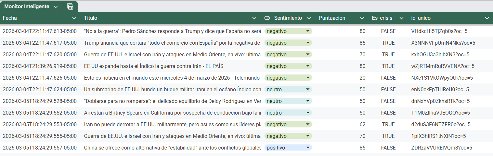

# 🧠 Monitor Inteligente de Noticias con IA

> Workflow automatizado con n8n + Groq AI que monitorea noticias globales, analiza sentimientos, genera gráficos en Google Sheets y envía alertas de crisis por Telegram.

---

## 📸 Vista General

<!-- AQUÍ VA LA CAPTURA DEL WORKFLOW COMPLETO EN N8N -->


---

## 📌 ¿Qué hace este proyecto?

**Monitor Inteligente** es un workflow automatizado que:

- 📡 Busca noticias cada hora de 5 temas globales via RSS de Google News
- 🤖 Analiza el sentimiento de cada noticia usando IA (Groq + LLaMA 3)
- 📊 Guarda los resultados automáticamente en Google Sheets
- 📈 Genera gráficos de sentimientos y puntuaciones
- 🚨 Envía alertas por Telegram cuando detecta una crisis

---

## 🛠️ Stack Tecnológico

| Tecnología | Uso |
|------------|-----|
| **n8n** | Orquestador del workflow |
| **Docker** | Contenedor para correr n8n localmente |
| **Groq API** | Motor de IA (LLaMA 3.1 8B) |
| **Google News RSS** | Fuente de noticias (sin API key) |
| **Google Sheets** | Almacenamiento de datos y gráficos |
| **Telegram Bot** | Alertas de crisis en tiempo real |

---

## 🔄 Arquitectura del Workflow

```
⏰ Monitor Inteligente (Schedule - cada hora)
    ↓
📋 Temas a Monitorear (Code - 5 temas)
    ↓
📡 Obtener RSS (HTTP Request - Google News)
    ↓
🔄 Parsear XML (XML to JSON)
    ↓
✂️ Extraer Titulares (Code - 5 noticias por tema)
    ↓
🤖 Analizar Sentimiento (Basic LLM Chain + Groq)
    ↓
⚙️ Parsear Resultado IA (Code)
    ↓
📊 Guardar en Sheets (Google Sheets)
    ↓
🚨 ¿Es Crisis? (IF)
    ↓ TRUE
📱 Alerta Telegram
```

---

## 📊 Google Sheets - Datos y Gráficos

<!-- AQUÍ VA LA CAPTURA DE GOOGLE SHEETS CON LOS DATOS -->


<!-- AQUÍ VA LA CAPTURA DE LOS GRÁFICOS -->


Cada noticia se guarda con:

| Campo | Descripción |
|-------|-------------|
| `Fecha` | Timestamp de detección |
| `Titulo` | Titular de la noticia |
| `Sentimiento` | positivo / negativo / neutro |
| `Puntuacion` | Intensidad del sentimiento (0-100) |
| `Es_crisis` | TRUE si la IA detecta crisis |
| `id_unico` | ID para evitar duplicados |

---

## 🚨 Alertas por Telegram

<!-- AQUÍ VA LA CAPTURA DE LAS ALERTAS EN TELEGRAM -->


Cuando la IA detecta una crisis (`Es_crisis: TRUE`) llega un mensaje automático con el titular, sentimiento y puntuación.

---

## 🌍 Temas Monitoreados

1. 🌍 Noticias mundo
2. 🤖 Inteligencia Artificial
3. ⚔️ Guerras y conflictos
4. 💻 Tecnología
5. 💰 Economía global

---

## 🚀 Cómo ejecutarlo

### Requisitos
- Docker Desktop instalado
- Cuenta de Google (Sheets)
- API Key de [Groq](https://console.groq.com)
- Bot de Telegram (via @BotFather)

### Pasos

1. Clona el repositorio:
```bash
git clone https://github.com/n8n-practicas/monitor-inteligente.git
```

2. Levanta n8n con Docker:
```bash
docker run -it --rm --name n8n -p 5678:5678 -v n8n_data:/home/node/.n8n docker.n8n.io/n8nio/n8n
```

3. Abre n8n en `http://localhost:5678`

4. Importa el archivo `workflow.json`

5. Configura tus credenciales:
   - Groq API Key
   - Google Sheets (OAuth2)
   - Telegram Bot Token

6. ¡Activa el workflow y listo! ✅

---

## 📁 Estructura del Repositorio

```
monitor-inteligente/
├── workflow.json          # Workflow exportado de n8n
├── README.md              # Este archivo
└── screenshots/workflow.png    # Capturas del proyecto
    ├── workflow.png        # Canvas de n8n
    ├── sheets.png          # Datos en Google Sheets
    ├── graficos.png        # Gráficos de sentimientos
    └── telegram.png        # Alertas de crisis
```

---

## 👩‍💻 Autora

**Daniela Valencia**  
[GitHub](https://github.com/n8n-practicas)

---

## 📝 Licencia

MIT License - libre para usar y modificar.
